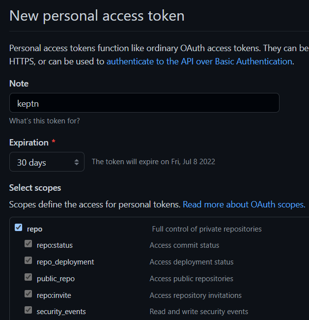
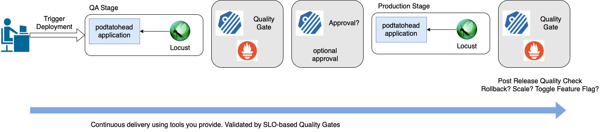

# Keptn Multistage Delivery and Self-Healing with Helm, Prometheus, Locust and SLO-based Quality Gates
The goal of this tutorial is to:

- Deploy a microservice (using [helm](https://helm.sh))
- Generate load on the deployed service (using [Locust](https://locust.io))
- Monitor the microservice (using [Prometheus](https://prometheus.io/))
- Add approval gates into the delivery pipeline
- Add automated SLO-based quality evaluations both pre and post release
- Show how Keptn can orchestrate self-healing patterns and tools (like scaling a helm deployment)

Keptn is not opinionated about tooling. A key strength of Keptn is it allows you to bring the tooling and observability platforms you already use and with which you are familiar.

That said, we needed to pick some tools, and Prometheus, Helm as well as Locust are commonly used tools.

The Prometheus observability platform is used to provide data for our exercise. The process is very similar if you use a different data source (integrations are also currently available for Dynatrace and DataDog).

Helm is used to deploy a microservice to a Kubernetes cluster. While other deployment strategies and tools can be used (e.g., argo, kubectl), this tutorial is very specific to Helm.

Last but not least, Locust is a modern Python based load testing tool. You can exchange it with any other load testing tool (integrations for JMeter, artillery, k6, and NeoLoad are available).

The tutorial will progress in steps:

1. Run automated tests that release our software into `qa` and `production` stages
2. Add an approval step to ensure a human must always click “go” before a production release
3. Replace the manual approval step with an automated quality gate. Add Prometheus to the cluster to monitor the workloads. Add SLO-based quality evaluations to ensure no bad build ever makes it to production
5. Add a quality evaluation in production, post rollout
6. Add a remediation action that will be taken by a remediation provider if an evaluation of the production stage fails. In the demo, this means helm scales the deployment

## While You're Waiting...

While you have been reading, we have been busy installing everything. It is still happening and should only take a few minutes.

While you wait, you will need a personal access token (PAT). We use this to create a new repository and so Keptn has a place to store and manage files.

> Important: For security, invalidate this token immediately after you have finished this tutorial.

You can use any Git provider but assuming you're using GitHub.com:

- Go to GitHub token's [setting page](https://github.com/settings/tokens) and generate a personal access token with full `Repo` permissions

## Relax...

You have everything you need now and just need to wait for us to finish the installation.

Please wait here until you see the text `Installation Complete 🎉. Please proceed now.` in the console.

While you wait, here is a visual of what you are about to build.

It should only take a few more minutes...

*Be aware that this environment is invalidated after 60 minutes or 20 minutes of keyboard inactivity, whichever comes first*
