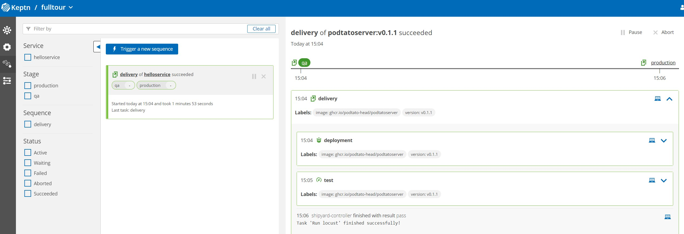

## Set Git Details

Keptn needs a brand new, uninitialised repo to store and manage configuration. We will create it automatically now.

Run this script to set your details. If you make a mistake, just click this again to reset things:

*💡 Hint: `Ctrl + Shift + v` works well in the terminal window to paste*

```
. ~/set_git_details.sh
```{{exec}}

## Create New Repository, Keptn Project and Trigger Artifact Delivery

Run the following script which will:

1. Create a new uninitialised Git repo on your account
2. Create a Keptn project and upload to the Git repo
3. Add all resources that Keptn, Locust and Helm need to run to your Git
4. Triggers the first delivery sequence of the microservice into `qa` and `production`

```
~/setup_keptn.sh
```{{exec}}

## 🎉 Delivery In Progress

Everything is setup correctly and the first artifact delivery sequence has been triggered. Watch progress in [the bridge]({{TRAFFIC_HOST1_8080}}/bridge/project/fulltour/sequence).

Locust runs for 1 minute (configurable) each time it responds to `test.triggered`. Load is generated once in the `qa` stage so expect the end-to-end delivery with Locust load tests to take about 3 minutes.



## Forgot the Bridge Login Details?

Thought so! Here you are.

```
~/print_bridge_login_details.sh
```{{exec}}
  
## While You Wait

While you are waiting for the release and load test to finish, why not have a look at your repo in a browser on GitHub.com.
  
Notice Keptn has created a branch per stage. Inside those branches are folders for each Keptn service.

## What Happened?

Run `kubectl get namespaces`{{exec}}

Notice the 2 new namespaces: `fulltour-qa` and `fulltour-production`. Your app `helloservice.tgz` is deployed into each namespace thanks to the job executor service that ran `helm` (look at the `qa` and `production` branches in your repo at `helloservice/job/config.yaml`).

Helm is told to deploy `$(KEPTN_STAGE).tgz` (ie. `helloservice.tgz`).

```
NAME                  STATUS
default               Active
kube-system           Active
kube-public           Active
kube-node-lease       Active 
keptn                 Active  
keptn-jes             Active   
fulltour-qa           Active   2m
fulltour-production   Active   2m
```

## Validate Application Versions

Validate that pods version `v0.1.1` is running in both environments.

```
kubectl -n fulltour-qa describe pod -l app=helloservice | grep Image:
kubectl -n fulltour-production describe pod -l app=helloservice | grep Image:
```{{exec}}

> Result: Keptn orchestrated your deployment which was achieved using `helm` to deploy and `locust` to generate load.

----

## What Next?

Your application is being deployed into both QA and Production. This is great and indeed Keptn works with ArgoCD and Flux in the same way to ensure code is always up to date.

Sometimes, a manual approval step is required before an artifact is promoted to production. This is especially important right now as we are not testing the quality of the `helloservice` artifact. We will now add this.
