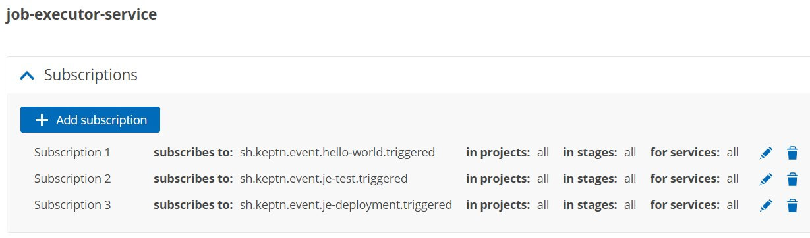

After installing and exposing Keptn, you can access the Keptn Bridge by using a browser and navigating to the Keptn endpoint without the api path at the end of the URL. You can also use the Keptn CLI to retrieve the Bridge URL using:

`keptn status`{{execute}}

## Authenticate Keptn Bridge

The Keptn Bridge has basic authentication enabled by default and the default user is keptn with an automatically generated password.

To get the username for authentication, execute:

`kubectl get secret -n keptn bridge-credentials -o jsonpath="{.data.BASIC_AUTH_USERNAME}" | base64 --decode`{{execute}}

To get the password for authentication, execute:

`kubectl get secret -n keptn bridge-credentials -o jsonpath="{.data.BASIC_AUTH_PASSWORD}" | base64 --decode`{{execute}}

Now, you can click on Dashboard tab, next to terminal tab which will ask you to authenticate the UI.

## Visualization 

You can also view the trigerred result in a UI

[ACCESS KEPTN BRIDGE]({{TRAFFIC_HOST1_80}})

## Create Github stuff
- Create a GitHub PAT with full repo scope. Keptn will use this token to ensure all files and changes are synced to the upstream repo.
- Create a blank (uninitialised) repository for Keptn to work with. Do not add any files (not even a readme)
- Set some environment variables like below

`export GIT_USER=<YourGitUsername>
export GIT_REPO=https://github.com/<YourGitUserName>/<YourRepo>
export GIT_TOKEN=ghp_****`

## Configure Keptn

To configure the keptn, we need to create a shipyard.yaml file 

`cat << EOF > shipyard.yaml
apiVersion: "spec.keptn.sh/0.2.2"
kind: "Shipyard"
metadata:
  name: "shipyard-delivery"
spec:
  stages:
    - name: "qa"
      sequences:
        - name: "delivery"
          tasks:
            - name: "je-deployment"
            - name: "je-test"

    - name: "production"
      sequences:
        - name: "delivery"
          triggeredOn:
            - event: "qa.delivery.finished"
          tasks:
            - name: "je-deployment"
EOF`{{execute}}

It looks like we have created shipyard manifest to deploy to the cluster

OR

Use the Keptn bridge to create the project visually

Now, let's create the project as `fulltour` and service called `helloservice` using Keptn CLI
`service` name must be called precisely that because the helm chart we use is called helloservice.tgz and the job executor runs helm install and relies on a file being available called helloservice.tgz.

`keptn create project fulltour \
--shipyard shipyard.yaml \
--git-remote-url $GIT_REPO \
--git-user $GIT_USER \
--git-token $GIT_TOKEN && 
keptn create service helloservice --project=fulltour`{{execute}}

## Add Required Files

Provide keptn with the important files it needs during the sequence execution. Your choice: Either upload directly to the upstream Git repo or use the keptn add resource commands. The result is the same. keptn add resource is just a helpful wrapper around git add / commit / push

In the web terminal, clone Christian’s PoC repo to download all necessary files:

`git clone https://github.com/christian-kreuzberger-dtx/keptn-job-executor-delivery-poc.git`{{execute}}

Add the helm chart (this is the real application we will deploy). The --resource path is the path to files on disk whereas --resourceUri is the Git target folder. Do not change these. Notice also we’re uploading a helm chart with a name matching the keptn service: helloservice.tgz

`cd keptn-job-executor-delivery-poc`{{execute}}
`keptn add-resource --project=fulltour --service=helloservice --all-stages --resource=./helm/helloservice.tgz --resourceUri=charts/helloservice.tgz`{{execute}}

Add the files that locust needs:

`keptn add-resource --project=fulltour --service=helloservice --stage=qa --resource=./locust/basic.py`{{execute}}
`keptn add-resource --project=fulltour --service=helloservice --stage=qa --resource=./locust/locust.conf`{{execute}}

Add the job executor service config file. This tells the JES what container and commands to execute for each keptn task:

`keptn add-resource --project=fulltour --service=helloservice --all-stages --resource=job-executor-config.yaml --resourceUri=job/config.yaml`{{execute}}

## Job Executor Must Listen for Events

The job executor service is currently configured to only listen and react on the sh.keptn.event.hello-world.triggered event. This was set during the initial installation.

We need the JES to fire on our new task events: `sh.keptn.event.je-deployment.triggered` and `sh.keptn.event.je-test.triggered`

Go to the integration page and add two new integrations for `je-deployment.triggered` and `je-test.triggered`.

The job executor service subscriptions should look like this:

## 🎉 Trigger Delivery

You are now ready to trigger delivery of the helloservice helm chart into all stages, testing along the way with locust:

You can trigger a sequence via the keptn’s API, via the bridge UI or via the keptn CLI:

`keptn trigger delivery \
--project=fulltour \
--service=helloservice \
--image="ghcr.io/podtato-head/podtatoserver:v0.1.1" \
--labels=image="ghcr.io/podtato-head/podtatoserver",version="v0.1.1"
`{{execute}}

