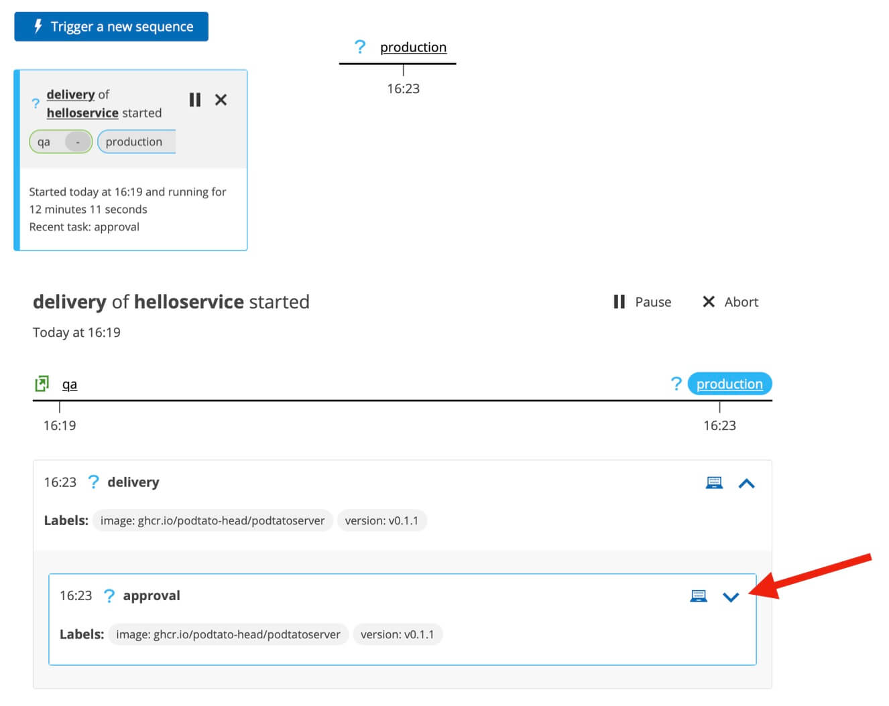
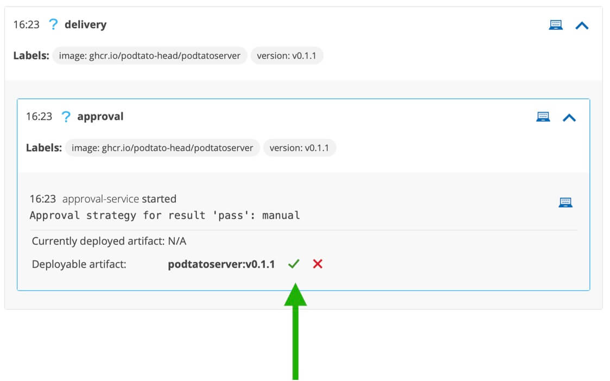
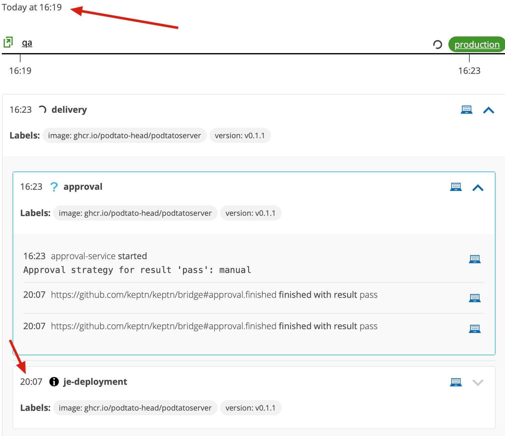

Add a step to the delivery sequence which enforces that a user must manually click ✅ before an artifact is promoted to production.

This script will set things up and trigger another artifact delivery:

```
~/add_approval_step.sh
```{{exec}}

## Approve Production Release

The artifact will be released into `qa` as before but the sequence now turns blue.

Manual interaction is required.

The sequence will pause here for as long as required.




Click the `production` link then inside the approval step, click ✅ to approve the build. Watch as the deployment begins, again via `helm`, facilitated by the job executor service.



----

## Summary

A new task was added to the shipyard file called `approval`. When it was time to action this task, Keptn created and distributed a cloudevent of type `sh.keptn.event.approval.triggered`. The [approval service](https://github.com/keptn/keptn/tree/master/approval-service) is a Keptn core microservice which listens for and actions this event.

The `properties` block in the shipyard file tells the approval service that a manual approval is required regardless of the success / fail output of the preceding task.

The `approval.finished` event will not be sent back to keptn until user input has been received and so the `deployment` task is not actioned until after a user clicks approve.

----

## What Next?

Blindly promoting artifacts to production and requiring manual approvals before each deployment are at opposite ends of the spectrum. One is dangerous, the other slows innovation. Is there a safer middle ground?

Perhaps an artifact is allowed to go into production if it passes the evaluation but manual approval is required if the quality evaluation is a warning or a failure.

In the next step, keptn will introduce "guard rails" in this process. The `helloservice` application will be monitored and releases will be programatically approved / declined based on a quality signature defined by you and calculated by keptn.
