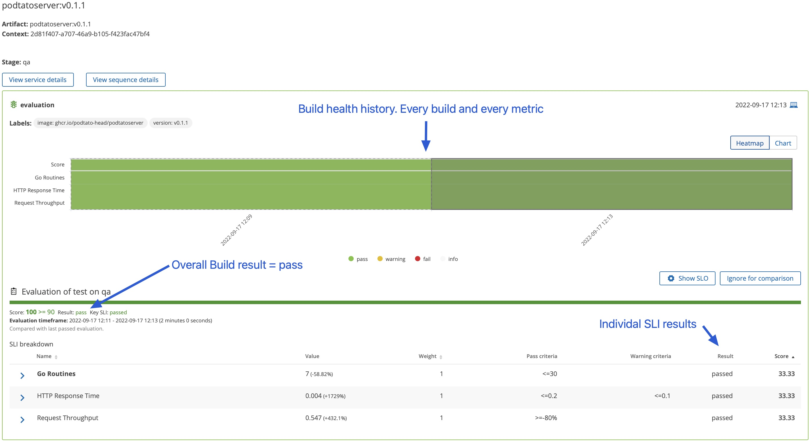
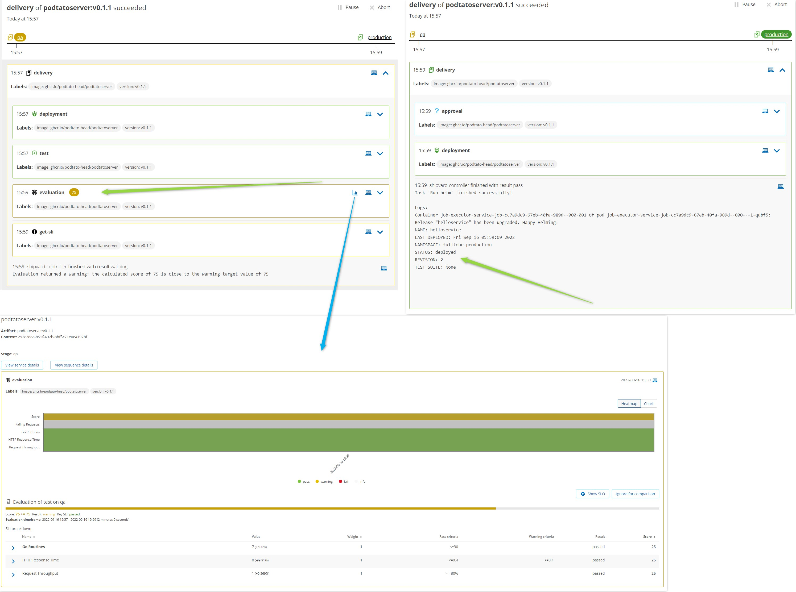
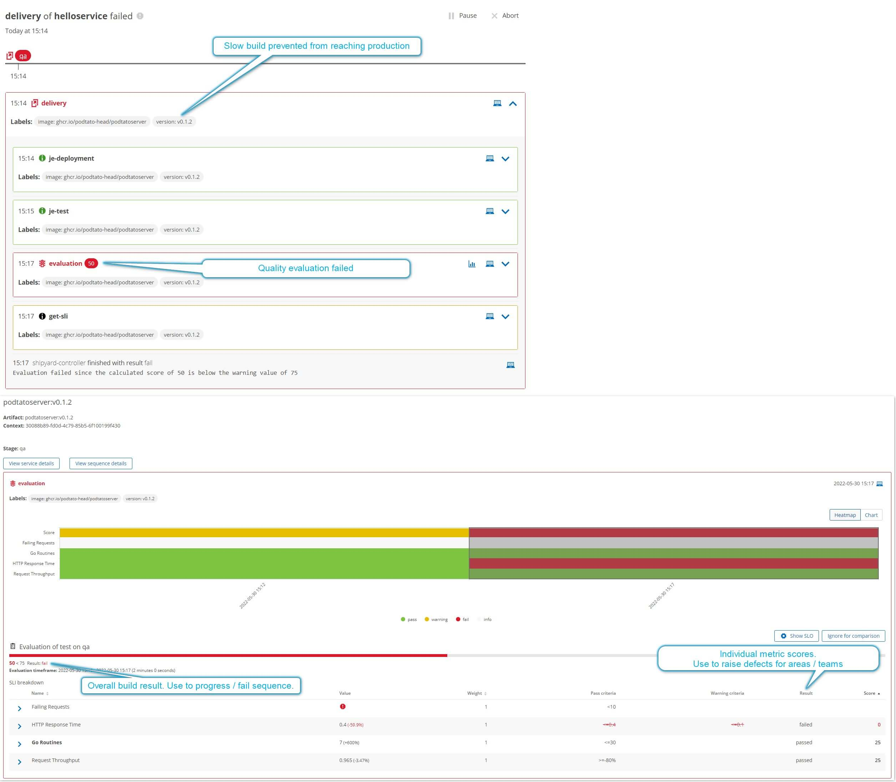

In this step an automated go / no-go decision step will be added. If, based on your criteria, Keptn decides the artifact is a `pass`, the release will be automatically promoted to production.

If the evaluation is a `failure`, the release will be blocked.

Prometheus has already been installed on the cluster, running in the `monitoring` namespace.

Keptn currently supports the following providers:

- Prometheus
- Dynatrace
- Datadog (experimental)
- Sumologic (experimental)
- Any others (request an [SLI provider here](https://github.com/keptn/integrations/issues))

Keptn is unopinionated on the observability platform that provides metrics for the quality evaluations.

Each observability provider will, of course, have strengths, weaknesses and slightly differing setups but overall, the big picture of what can be achieved with Keptn remains the same.

## Configure Prometheus and Run an SLO-based Quality Gated Release

Run the following script which will:

1. Configure the fulltour Keptn project to use Prometheus
2. Add a quality evaluation step to the `qa` stage. This is configured to **allow** `pass` or `warning` quality builds and **block** any `failed` quality builds
3. Trigger a new delivery sequence

```
~/quality_gated_release.sh
```{{exec}}

Refresh the bridge screen to watch progress.

## Outcome

The artifact receives a pass score which we told Keptn was still good enough to allow an automatic release. Keptn stores a full history of every previous evaluation and will automatically compare new builds against old.




Wait until the sequence has completed then check the application version running in each environment:

```
kubectl -n fulltour-qa describe pod -l app=helloservice | grep Image:
kubectl -n fulltour-production describe pod -l app=helloservice | grep Image:
```{{exec}}

Should show `v0.1.1` in both environments.

## Attempt to Release a Slow Build

Now attempt to release a slow build. Keptn will release the artifact to `qa` as there are no quality checks in `qa`.
The quality evaluation before production will fail (as it should), thus the slow artifact is never released to production - protecting users.

```
keptn trigger delivery \
--project=fulltour \
--service=helloservice \
--image="ghcr.io/podtato-head/podtatoserver:v0.1.2" \
--labels=image="ghcr.io/podtato-head/podtatoserver",version="v0.1.2"
```{{exec}}



Wait until the sequence has completed then check the application version running in each environment:

```
kubectl -n fulltour-qa describe pod -l app=helloservice | grep Image:
kubectl -n fulltour-production describe pod -l app=helloservice | grep Image:
```{{exec}}

Should show `v0.1.2` in `qa` and `v0.1.1` in `production`.

## What Next?

Hopefully releases are now regression-proof and bad builds never make it to production.

In reality though, problems may only occur in production so the release process can be enhanced further.

Next, a post-release quality evaluation will be added to the production environment which runs after each successful release.

If this evaluation fails, it is a signal that perhaps we should rollback the release.
