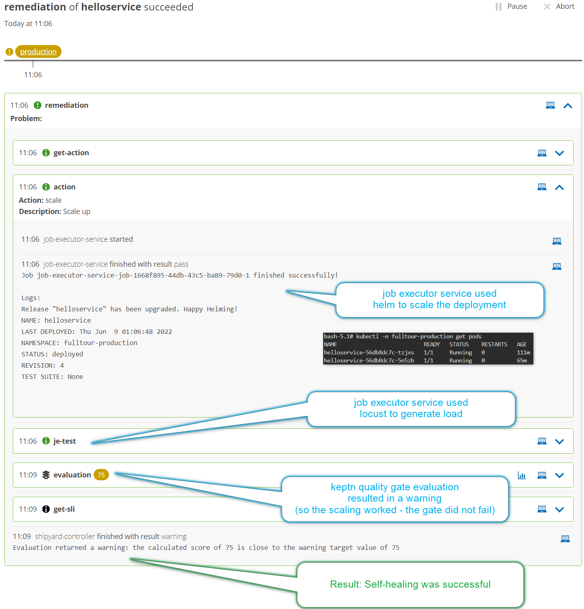

So far, a fairly robust delivery pipeline has been built. Optional manual approval steps have been added, automated quality gates were then added to automate and improve on the previous manual approval.
Finally, release validation was added to run quality evaluations **after** a production release and ensure quality software **in** production.

This step adds the ability to Keptn to self-heal your application based on problems sent to Keptn.

## Scenario

Imagine the application has a known response time problem in production. It can be fixed by scaling the pods - at least until development has a chance to look into the issue.

We will add steps into our Keptn setup to:
1. Scale the pods (using Helm to upgrade the deployment) when a response time problem is received.
2. Use `locust` to generate some new load after the deployment has been scaled
3. Run a quality evaluation to see if the scaling has resolved the issue

> Note: The demo image doesn't actually have a problem pattern that resolves with scaling. So **expect** the quality gate to still provide a warning. Scaling the pods **will** be successful.

## Setup Problem Definition and Remediation Action

Run this script which:

1. Tells Keptn to expect incoming problems of a certain type
2. Tells Keptn what to attempt in such scenarios (eg. scale)
3. Tells Job executor service to respond to these scaling requests
4. Tells Job executor service that Helm should upgrade the deployment with the new replica count (2 pods not 1)
5. Creates a dummy problem which we can use to repeatedly trigger this scenario

```
~/self_healing.sh
```{{exec}}


## Trigger a Problem

In reality you would expect alerts from Prometheus alert manager or any external tool capable of informing Keptn of problems.

For the speed of the demo though, we will use a dummy problem. Send Keptn the problem event and watch Keptn scale the pods:

```
keptn send event -f ~/remediation_trigger.json
```{{exec}}

When the sequence is complete, you should see:


  
## See Scaling

`qa` environment should still have 1 pod running. `production` environment should have scaled up to 2 pods.

```
kubectl -n fulltour-qa get pods
kubectl -n fulltour-production get pods
```{{exec}}
  
```
$ kubectl get pods -n fulltour-qa
NAME                           READY   STATUS    RESTARTS   AGE
helloservice-56db8dc7c-mvqxx   1/1     Running   0          17m

$ kubectl get pods -n fulltour-production
NAME                           READY   STATUS    RESTARTS   AGE
helloservice-56db8dc7c-6bvf4   1/1     Running   0          14m
helloservice-56db8dc7c-2wp4s   1/1     Running   0          67s
```
